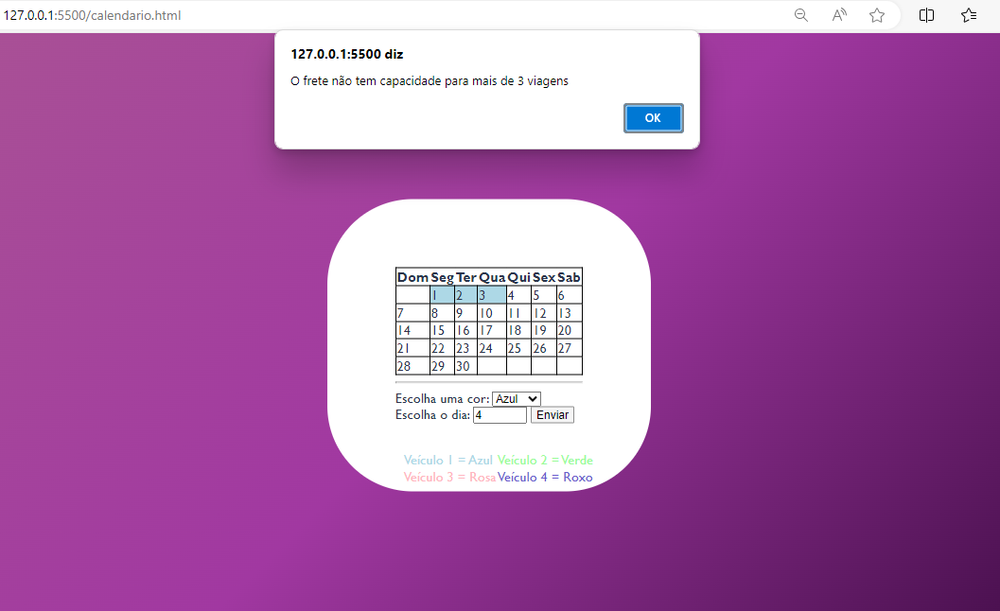

# **Calendário interativo com JavaScript**

# ``Descrição``
Este é um projeto simples de calendário interativo criado por HTML, CSS e JS. Ele exibe um calendário básico com os dias do mês atual e permite a seleção de uma cor e de um dia para colorir o fundo.

# ``Arquivos`` 

- **calendario.html:** Este arquivo contém a estrutura HTML para o calendário, incluindo a tabela dos dias do mês, as opções de cor e a lógica JavaScript para colorir os dias selecionados.
  
- **style.css**: Este arquivo contém o estilo CSS para o calendário e as legendas de cor.

- **calendar.js**: Este arquivo contém o código JavaScript para a funcionalidade de colorir os dias do calendário com a cor selecionada.

# ``Pré-visualização``



# ``calendario.html``

```html

<!-- Calendário HTML -->

<!DOCTYPE html>
<html>
 
<head>
    <meta charset='utf-8'>
    <meta http-equiv='X-UA-Compatible' content='IE=edge'>
    <title>Calendário</title>
    <meta name='viewport' content='width=device-width, initial-scale=1'>
    <link rel='stylesheet' type='text/css' media='screen' href='style.css'>
    <script src='calendar.js'></script>
</head>
 
<body>
    <div id="calendario">
        <table id="calendar">
            <!--tabela-->
            <body>
                <!--corpo da tabela-->
                <tr>
                    <!--(Primeira linha)cria uma linha-->
                    <th class="domingo">Dom</th>
                    <!--coluna-->
                    <th>Seg</th>
                    <th>Ter</th>
                    <th>Qua</th>
                    <th>Qui</th>
                    <th>Sex</th>
                    <th>Sab</th>
                </tr>
                <tr>
                    <!--Segunda linha-->
                    <th class="domingo"></th>
                    <td>1</td>
                    <td>2</td>
                    <td>3</td>
                    <td>4</td>
                    <td>5</td>
                    <td>6</td>
                </tr>
                <tr>
                    <!--Terceira linha-->
                    <td class="domingo">7</td>
                    <td>8</td>
                    <td>9</td>
                    <td>10</td>
                    <td>11</td>
                    <td>12</td>
                    <td>13</td>
                </tr>
                <tr>
                    <!--Quarta linha-->
                    <td class="domingo">14</td>
                    <td>15</td>
                    <td>16</td>
                    <td>17</td>
                    <td>18</td>
                    <td>19</td>
                    <td>20</td>
                </tr>
                <tr>
                    <!--Quinta linha-->
                    <td class="domingo">21</td>
                    <td>22</td>
                    <td>23</td>
                    <td>24</td>
                    <td>25</td>
                    <td>26</td>
                    <td>27</td>
                </tr>
                <tr>
                    <!--Sexta linha-->
                    <td class="domingo">28</td>
                    <td>29</td>
                    <td>30</td>
                    <td></td>
                    <td></td>
                    <td></td>
                    <td></td>
                </tr>
            </body>
        </div>
    <p class="leg" id="Azul"> Veículo 1 = Azul</p>
    <p class="leg" id="Verde"> Veículo 2 = Verde</p>
    <p class="leg" id="Rosa"> Veículo 3 = Rosa</p>
    <p class="leg" id="Roxo"> Veículo 4 = Roxo</p>
        </table>
    
    <hr/>
    <label for="color">Escolha uma cor:</label>
    <select id="color" name="color">
        <option value="LightBlue">Azul</option>
        <option value="Palegreen">Verde</option>
        <option value="LightPink">Rosa</option>
        <option value="SlateBlue">Roxo</option>
    </select>
    <label for="day">Escolha o dia:</label>
    <input type="number" id="day" name="day" min="1" max="30">
    <input type="submit"onclick="colorirDia()">

   
</body>
</html>
```


# ``calendar.css``

```html

<!-- Style CSS -->

table, td, tr{
    border: 1px solid black;
    border-collapse: collapse;
   
}
body{
    width: 100%;
    height: 100vh;
    font-family:'Gill Sans', 'Gill Sans MT', Calibri, 'Trebuchet MS', sans-serif;
    background: linear-gradient(-45deg, #3c0a42, #a138a1, #aa5494);
}
 
#calendario{
    position: relative;
    top: 50%;
    left: 50%;
    transform: translate(-50%, -50%);
    background: #fff;
    border-radius: 10px;
    padding: 80px;
    width: min-content;
    align-items: center;
    color: #2b344b;
}
p#Azul{
    font-family:'Gill Sans', 'Gill Sans MT', Calibri, 'Trebuchet MS', sans-serif;
    color: lightblue; 
    position: absolute; left: 90px; top: 280px;
}
p#Verde{
    font-family:'Gill Sans', 'Gill Sans MT', Calibri, 'Trebuchet MS', sans-serif;
    color: palegreen;
    position: absolute; left: 200px; top: 280px;
}
p#Rosa{
    font-family:'Gill Sans', 'Gill Sans MT', Calibri, 'Trebuchet MS', sans-serif;
    color: lightpink;
    position: absolute; left: 90px; top: 300px;
}
p#Roxo{
    font-family:'Gill Sans', 'Gill Sans MT', Calibri, 'Trebuchet MS', sans-serif;
    color:slateblue ;
    position: absolute; left: 200px; top: 300px;
}

div#calendario{ border-radius: 100px;}
```


# ``calendar.js``

```html

<!-- Calendar JS -->

let colorCounts = {};
 
function colorirDia() {
    let days = document.getElementById('day').value;
    let color = document.getElementById('color').value;
    let calendar = document.getElementById('calendar');
    let tds = calendar.getElementsByTagName('td');
   
    if (parseInt(days) > 30) {
        alert("Esse número é inválido. O número não pode ser maior do que 30.");
        return; 
    }
 
    let index = parseInt(days) - 1;
   
    if (index >= 0 && index < tds.length) {
        if (colorCounts[color] >= 3) {
            alert('O frete não tem capacidade para mais de 3 viagens');
            return;
        }
       
        colorCounts[color] = (colorCounts[color] || 0) + 1;
 
        tds[index].style.backgroundColor = color;
    } else {
        alert('Dia selecionado está fora do intervalo válido.');
    }
}
```

# ``Observações``

- O calendário é para o mês atual e possui dias estáticos para simplificar a implementação.
- A seleção de cores é limitada a quatro opções pré-definidas.
- Cada cor pode ser selecionada no máximo três vezes antes de uma mensagem de alerta ser exibida.

# ``Ferramenatas utilizadas``
- HTML5
- CSS3
- JavaScript

# ``Autores``
- Ricardo Siena
- Deivid Marques
- Eric Mendes

